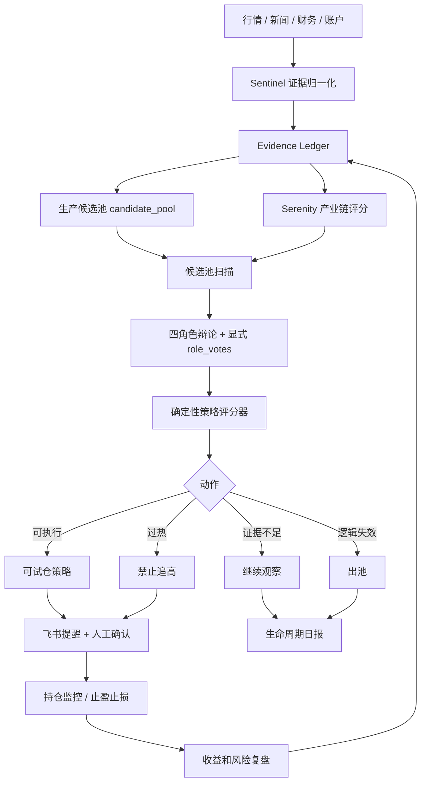

# 以盈利为目标的项目运行逻辑与 Sentinel / Serenity 决策

日期：2026-07-01
分支：`codex/quant-lifecycle-v7-4`
状态：架构决策备忘录

## 第一原则

本项目只有一个主目标：

> 选出标的，给出可执行策略，用户按策略操作，最终通过复盘和迭代提高盈利概率。

所有模块都必须服务这个目标。数据采集、研究、辩论、报告、监控、预警都不是目的本身。

模块存在的最低标准：

- 能提高候选标的发现能力。
- 能提高策略准确率。
- 能降低明显亏损和追高风险。
- 能提高入场/退出时机。
- 能让复盘反过来改进下一次选股和策略。

如果一个模块只生成文件、只增加章节、只让系统看起来更复杂，但不影响候选池、策略、预警或复盘权重，就不应该留在生产主线。

## 对三个问题的直接回答

### 1. Sentinel 研究包对策略没有影响，它存在的意义在哪里？

按当前代码事实，Sentinel 研究包对策略主链的直接意义不足。

当前实际作用：

- 聚合新闻、主题、标的提及和风险关键词。
- 生成研究包和日报展示章节。
- 生成角色预测留痕。
- 支持 Serenity 深挖作为学习档案。

当前缺失：

- 没有进入 `run_debate()` 输入。
- 没有进入生产 `candidate_pool`。
- 没有驱动午盘/午后预警。
- 没有形成 role score 到权重调整的闭环。

因此，当前 Sentinel 如果不改造，只适合作为旁路研究归档，不值得作为生产核心模块继续加复杂度。

它应该被保留的唯一理由：

> Sentinel 能把碎片新闻和研究输入转成可追踪、可回测、可入池的证据事件。

改造后它必须承担四个生产职责：

1. **候选生成**：从新闻和主题中提取 A 股候选，写入生产候选池。
2. **证据增强**：给候选池标的增加主题热度、风险事件、证据来源和时间戳。
3. **风险过滤**：识别监管、减持、亏损、退市、暴雷等风险，给候选或持仓打风险标签。
4. **复盘归因**：记录“哪个证据导致入池/提醒/禁止追”，事后验证这条证据是否有效。

不能做到这四点，Sentinel 就应该降级为归档工具，不进入生产策略链。

### 2. Serenity 瓶颈研究对策略池和辩论观点到底占多少？

当前实际权重：没有确定权重。

当前 Serenity 的实际作用：

- 作为第 4 个角色参与盘前辩论。
- 裁判 prompt 能看到 Serenity 的 `researcher_view`。
- 降级路径中 Serenity 只影响 `top_sectors`、`confidence` 和 reasoning。
- Serenity 独立研究池 `data/serenity/theme_candidates.json` 不等于生产候选池。

所以当前不能说 Serenity 占 25%，也不能说它对策略池有稳定影响。它只是“有机会影响裁判”，但没有确定性和可审计性。

正确设计应该是双通道影响：

#### A. 对候选池的影响

Serenity 只负责产业链质量，不直接给买点。

它应该提供：

- 这个标的是否处于真实瓶颈环节。
- 主题是不是已经过热。
- 候选公司的产业链卡点是什么。
- 需要补哪些财务、订单、客户、产能证据。
- 研究评分和待核验任务。

候选池中的建议初始权重：

| 因子 | 建议权重 | 说明 |
|---|---:|---|
| 技术触发 | 30 | 是否有涨幅、量比、突破、趋势确认 |
| 流动性与可买性 | 20 | 成交额、一手金额、现金约束 |
| Sentinel 主题热度 | 15 | 新闻密度、主题持续性、风险事件 |
| Serenity 产业链评分 | 15 | 卡点、稀缺性、候选评分 |
| 基本面/估值 | 10 | 财务质量、估值、盈利能力 |
| 风控惩罚 | -30 到 0 | 涨停追高、ST、退市、暴雷、守夜人否决 |

这意味着 Serenity 在生产候选评分中初始占 15%，不是主导因子。

小账户短期盈利验证阶段，技术触发和流动性必须更重，因为用户要看到短期收益；Serenity 主要用于提高标的质量和避免伪题材。

#### B. 对辩论观点的影响

Serenity 应该影响裁判对“逻辑质量”的判断，而不是替代买点判断。

裁判输出必须增加：

```json
{
  "role_votes": {
    "hunter": {"score": 0, "reason": ""},
    "accountant": {"score": 0, "reason": ""},
    "guardian": {"veto": false, "reason": ""},
    "serenity": {"score": 0, "reason": ""}
  }
}
```

如果没有这个字段，就不能说 Serenity 对最终策略有多大贡献。

### 3. Sentinel 对辩手和裁判的旁观打分，与研究有没有关系？

当前关系很弱。

当前 Sentinel role performance 是旁路：

- 记录辩手和裁判说过什么。
- 未来可以对 1/3/5/20 日结果回看。
- 目前不改变 prompt、权重、候选池或账户状态。

它和研究包之间没有强绑定：

- 研究包里的主题和候选没有稳定 evidence_id。
- 辩论建议没有标明用了哪条 Sentinel 证据。
- role score 没有回写到下一次裁判权重。

正确关系应该是：

```text
Sentinel 研究证据
  -> evidence_id
  -> 候选入池 / 辩论引用 / 策略建议
  -> 盘后结果
  -> 评价这条证据、这个角色、这个裁判是否有效
  -> 调整下一轮权重或提示词
```

也就是说，旁观打分必须评价“证据是否带来了收益或避免了亏损”，而不是只评价角色文字是否好看。

必须统一成一套 Evidence Ledger：

- 每条新闻主题有 `evidence_id`。
- 每个 Serenity 候选有 `evidence_id`。
- 每个辩论建议引用若干 `evidence_id`。
- 每次候选池提醒引用若干 `evidence_id`。
- 每次操作或未操作进入复盘。
- 最后统计哪些证据和角色真的有用。

如果没有 Evidence Ledger，Sentinel 打分就是旁观记录，不是盈利改进工具。

## 面向盈利的完整管线

正确生产管线应该是：



## 各模块必须交付的盈利相关功能

### 数据采集

目的：发现机会和风险。

必须输出：

- 可用于候选池的标的。
- 可用于策略评分的行情字段。
- 可用于排除的风险字段。

不能只输出原始新闻或泛泛摘要。

### Sentinel

目的：把信息噪声变成可追踪证据。

必须输出：

- 主题热度。
- A 股候选。
- 风险事件。
- evidence_id。
- 入池建议和未入池原因。

不能只输出研究报告。

### Serenity

目的：判断标的是否有真实产业链逻辑。

必须输出：

- 产业链评分。
- 卡点说明。
- 过热风险。
- 待核验证据。
- 对候选池的加分或降级理由。

不能只做学习档案。

### 辩论

目的：多视角校验策略，不是表演观点。

必须输出：

- 每个标的的角色投票。
- 守夜人 veto。
- 裁判采用/否决理由。
- 候选池状态迁移建议。

不能只输出自然语言观点。

### 策略

目的：给用户可执行动作。

必须输出：

- 买不买。
- 买多少。
- 何时买。
- 止损价。
- 止盈价。
- 什么情况取消。
- 什么情况出池。

不能只说“关注”或“观望”。

### 监控和预警

目的：把策略从一次性报告变成连续执行。

必须输出：

- 可试仓提醒。
- 禁止追高提醒。
- 止损提醒。
- 止盈提醒。
- 逻辑失效提醒。

不能只做每日总结。

### 复盘

目的：证明哪些模块真的帮助盈利。

必须输出：

- 每个候选来源的收益表现。
- Sentinel 证据有效率。
- Serenity 候选有效率。
- 猎手/账房/守夜人/Serenity/裁判贡献。
- 错失机会原因。
- 下一轮权重调整建议。

不能只做流水账。

## 模块去留标准

一个模块连续两周或至少 20 个候选样本后，如果仍然满足以下任一条件，就应该降级或移出生产主线：

- 不能产生候选。
- 不能改变候选评分。
- 不能改变策略动作。
- 不能触发预警。
- 不能降低风险。
- 不能被复盘证明有贡献。

Sentinel 和 Serenity 也适用这个标准。

## 对当前项目的判断

当前项目主链正在从“报告系统”转向“交易辅助系统”，但 Sentinel / Serenity 还没有完成这个转变。

当前状态：

- 候选池基础服务已建立。
- 持仓池基础服务已建立。
- 午盘/午后扫描已开始接入。
- Sentinel / Serenity 仍然主要停留在研究和展示层。

所以现在的正确做法不是继续扩展更多研究报告，而是把研究变成可执行证据：

1. Sentinel 研究包进入候选池。
2. Serenity 评分进入候选评分。
3. 辩论输出 role_votes。
4. 策略评分器给出明确动作。
5. 飞书提醒触发操作机会和风险。
6. 收盘复盘证明每个模块是否有贡献。

## 决策

保留 Sentinel 和 Serenity，但必须改变职责：

- Sentinel 不再只是研究包；它必须成为证据归一化和复盘归因层。
- Serenity 不再只是辩论观点；它必须成为产业链评分因子。
- 二者都不能直接下单。
- 二者都必须影响候选池、策略评分或复盘权重。

若下一阶段无法完成这些接入，则 Sentinel / Serenity 只能保留为研究归档，不应继续占生产主线复杂度。

## 下一步实现顺序

1. 建立 Evidence Ledger。
2. Sentinel package 转候选池事件。
3. Serenity top_candidates 写入生产候选池。
4. `run_debate()` 注入 Sentinel evidence。
5. 裁判输出 `role_votes`。
6. 候选池扫描纳入 Sentinel/Serenity 分数。
7. 报告引擎展示每个候选的来源、证据、状态和收益归因。
8. 收盘复盘生成模块贡献报告。

