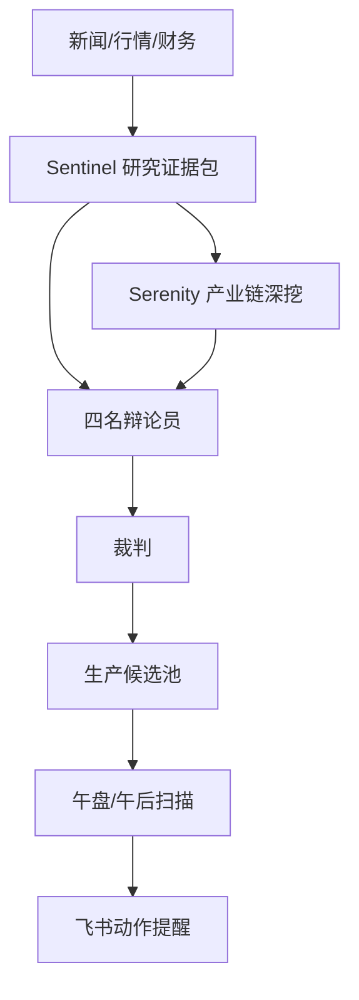
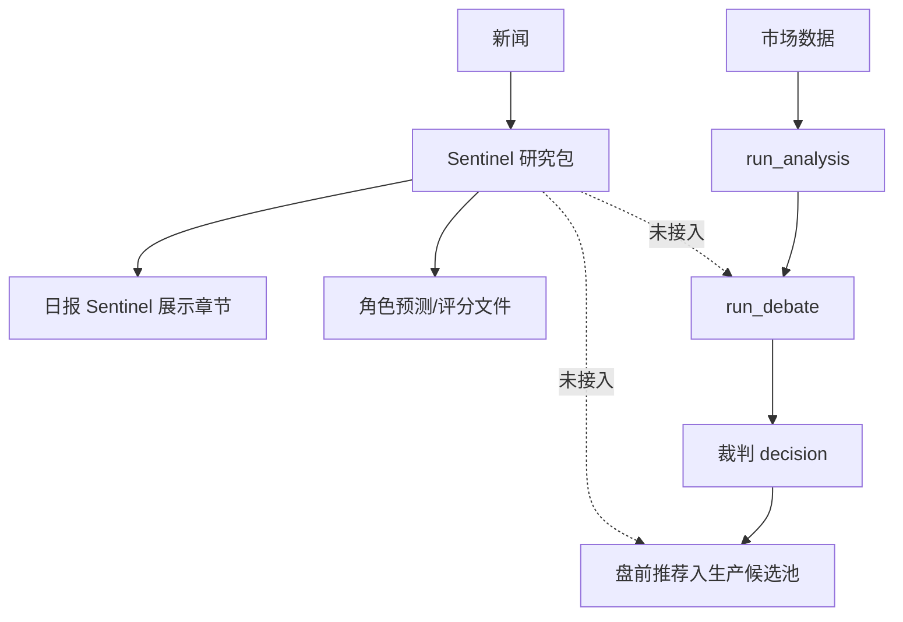

# Sentinel / Serenity 管线深度 Review

日期：2026-07-01
分支：`codex/quant-lifecycle-v7-4`
结论等级：P0 架构缺口

## 总结

当前 Sentinel / Serenity 的实际作用弱于文档目标。

- Serenity 作为第 4 个辩论角色确实参与盘前辩论。
- Serenity 对最终策略没有确定性权重，影响依赖裁判模型自由吸收。
- Sentinel 研究包目前没有进入 `run_debate()` 的输入。
- Sentinel 研究包目前没有进入生产 `candidate_pool`。
- Sentinel 角色绩效目前只有预测留痕，尚未形成可用于调权的真实回看闭环。
- 日报会展示 Sentinel 研究输入，但展示发生在辩论之后，不能反向影响当天策略。

因此，现在不能说 Sentinel / Serenity 已经稳定影响标的池和最终策略。准确说法是：

> Serenity 对辩论有软影响；Sentinel 对报告有展示影响、对绩效有留痕影响，但对生产候选池和策略主链几乎没有硬影响。

## Findings

### P0：Sentinel 研究包没有进入辩论输入

证据：

- `scripts/daily_report.py` 在完成 `run_analysis()` 和 `run_debate()` 后，才调用 `load_sentinel_research_package(today)`。
- `backend/app/engine/workshop.py` 的 `run_debate()` 只读取 `analysis_report["news"]`，没有读取 Sentinel package。
- `backend/app/engine/analysis.py` 的分析输入只透传 `market_data["news"]`，没有 Sentinel evidence 字段。

影响：

- Sentinel 研究包不会影响猎手、账房、守夜人、Serenity 研究员的 prompt。
- Sentinel 研究包不会影响裁判裁决。
- Sentinel 研究包不会影响当天 `stock_pool`。
- 主报告里的 Sentinel 章节只是“报告展示”，不是“策略输入”。

修复方向：

- 在 `daily_report.py`、`main.py` 的盘前链路中，先加载 Sentinel package，再进入 `run_analysis()` 和 `run_debate()`。
- 给 `run_analysis()` / `run_debate()` 增加 `sentinel_evidence` 字段。
- 四名辩论员和裁判 prompt 都必须显式引用 Sentinel 证据摘要。

### P0：Sentinel / Serenity 没有进入生产候选池

证据：

- 新生产候选池服务 `CandidatePoolStore` 已存在，但当前入池入口来自盘前 `decision` 的推荐项。
- 没有 `upsert_sentinel_candidates()` 或等价适配器。
- 本地当前没有 `data/candidate_pool.json`，说明 Sentinel/Serenity 没有自动落入生产标的池。
- 2026-06-30 Sentinel 包有 1705 条新闻、3 个 Serenity 深挖主题，但没有进入生产候选池。

影响：

- Sentinel 研究包和 Serenity 深挖即使识别出候选，也不会被午盘/午后扫描。
- 用户关心的“关注标的后续上涨是否提醒”无法由 Sentinel/Serenity 链路解决。
- 研究和执行仍然断开。

修复方向：

- 新增 `upsert_sentinel_research_package(package, CandidatePoolStore)`。
- 将 `serenity_deep_dives[].top_candidates` 转为候选池事件。
- 入池状态默认 `watching`，来源为 `sentinel_serenity`。
- 必须记录 `theme`、`score`、`chokepoint`、`verify_next`、`learning_report_path`。
- 只有经过实时行情、成交额、一手金额和 ST/退市过滤后，才允许升级为 `actionable`。

### P0：Serenity 参与辩论，但没有可审计权重

证据：

- `AIDebateEngine.debate()` 并行调用猎手、账房、守夜人和 Serenity 研究员。
- 裁判 prompt 包含 `researcher_view`。
- 但没有任何 `role_weight` 参数。
- 裁判输出如何吸收 Serenity 观点完全由 LLM 自由决定。
- `workshop._repair_final_decision()` 的降级路径只把 Serenity 用于 `top_sectors` 和均值 `confidence`，最终 `short_term.recommendations` 来自猎手，`mid_low_freq.recommendations` 来自账房。

影响：

- Serenity 有参与，但没有可量化贡献。
- 无法回答“Serenity 权重是多少”。
- 当前只能说它在裁判 prompt 里占一个角色输入位，不等于 25% 权重。
- 若裁判忽略 Serenity，系统没有强制机制。
- 若裁判 JSON 失败，Serenity 推荐不会直接进入最终 stock_pool。

修复方向：

- 在裁判 prompt 中加入明确的角色采用矩阵：
  - 猎手：短线触发。
  - 账房：基本面/估值。
  - 守夜人：否决权。
  - Serenity：产业链和主题证据。
- 裁判必须输出每个推荐标的的 `role_votes`。
- 生产侧再用确定性评分，而不是只靠 LLM 自由判断。

建议初始评分：

| 因子 | 权重 | 说明 |
|---|---:|---|
| 技术触发 | 30 | 涨幅、量比、均线、突破 |
| 流动性与可买性 | 20 | 成交额、一手金额、现金约束 |
| Sentinel 主题热度 | 15 | 新闻密度、风险事件、主题持续性 |
| Serenity 产业链评分 | 15 | 卡点、稀缺性、候选评分 |
| 基本面/估值 | 10 | 财务和估值 |
| 风控惩罚 | -30 到 0 | 守夜人风险、涨停追高、ST/退市等 |

守夜人不应只是权重，而应有 veto 机制。

### P1：Sentinel 角色绩效有留痕，但没有调权闭环

证据：

- `sentinel_role_performance.py` 明确写着旁路记录，不改变交易行为、角色权重、prompt 或账户状态。
- `record_debate_predictions()` 会记录 hunter/accountant/guardian/researcher/judge 的预测。
- 本地已有 `role_predictions`，但 `role_scores/2026-06-30.json` 的 `roles` 为空。
- `run_debate()` 注入的是 `DebateTracker.get_performance_summary()`，不是 Sentinel `role_scores`。

影响：

- Sentinel 目前不能证明 Serenity 或其他角色近期有效。
- 即使有 `increase_weight / decrease_weight` 建议类型，也没有接入实际权重。
- “Serenity 有没有作用”目前缺少结果评估样本，无法从数据证明。

修复方向：

- 收盘任务必须回填 role outcome。
- `role_scores` 非空后，再将评分摘要注入裁判 prompt。
- 调权不能直接自动执行，先输出建议：
  - `keep_weight`
  - `increase_weight`
  - `decrease_weight`
  - `review_prompt`
  - `require_human_review`

### P1：日报 Sentinel 章节容易造成“已参与策略”的错觉

证据：

- 主报告包含 `## 五、Sentinel 研究输入`。
- 但该章节是在辩论之后构建的展示内容。
- 报告还写“样本不足时只显示观察，不自动调整权重或 prompt”。

影响：

- 用户看到报告会以为 Sentinel 已经参与策略。
- 实际上它只是展示和审计，不是策略输入。
- 这会导致对系统有效性的误判。

修复方向：

- 报告必须明确标注：
  - `已进入策略输入`
  - `仅报告展示`
  - `已进入候选池`
  - `未进入候选池：原因`
- 每个 Sentinel/Serenity 候选都要显示状态迁移。

## 管线设计 vs 实际作用

### 设计目标



### 当前实际



## 对标的池的实际影响

当前影响：接近 0。

原因：

- `data/candidate_pool.json` 当前不存在。
- Sentinel 没有适配器写入 `CandidatePoolStore`。
- Serenity 独立候选池 `data/serenity/theme_candidates.json` 是研究种子池，不是生产候选池。
- 生产候选池当前只接盘前裁判最终推荐，而不是 Sentinel/Serenity 研究输出。

需要达到的目标：

| 来源 | 当前状态 | 目标状态 |
|---|---|---|
| 盘前 AI 推荐 | 已可入生产候选池 | 保持 |
| Sentinel top_symbols | 未入池 | 经 A 股代码校验后入池 |
| Sentinel top_themes | 未入池 | 转为主题观察，不直接交易 |
| Serenity top_candidates | 未入池 | 入池观察，等待行情触发 |
| 手动关注 | 未完成 | 手动入池 |
| 新闻风险事件 | 仅报告展示 | 转为候选/持仓风险标签 |

## 对策略输出的实际影响

### Serenity

有作用，但不可审计。

- 正常裁判路径：Serenity 文本进入裁判 prompt。
- 裁判是否采用：不可控。
- 采用比例：不可量化。
- 降级路径：Serenity 只影响 `top_sectors`、`confidence` 和 reasoning，不直接提供最终推荐池。

### Sentinel

当前对策略输出没有直接作用。

- 不进入 `run_analysis()`。
- 不进入 `run_debate()`。
- 不进入 `CandidatePoolStore`。
- 只进入日报展示和角色预测旁路。

## 修复方案

### Step 1：先接 Sentinel evidence 到辩论输入

新增：

- `build_sentinel_evidence_context(package) -> str`
- `analysis_report["sentinel_evidence"]`
- `run_debate(..., sentinel_evidence=...)`

要求：

- 四名辩论员都能看到同一份证据摘要。
- 裁判输出必须说明采用了哪些 Sentinel 证据。
- 没有 Sentinel 包时，旧流程必须可运行。

### Step 2：接 Sentinel/Serenity 到生产候选池

新增：

- `upsert_sentinel_candidates(package, store)`
- `source="sentinel_serenity"`
- `watch_reason="research_candidate"`

入池过滤：

- 代码必须是 6 位 A 股。
- 必须能取到实时行情。
- 必须有成交额和流动性。
- 一手金额必须能计算。
- 涨停或接近涨停只允许 `blocked_chasing`。

### Step 3：候选池扫描使用研究评分

扩展 `CandidatePoolStore` item：

- `sentinel_theme_count`
- `sentinel_risk_flags`
- `serenity_score`
- `serenity_chokepoint`
- `verify_next`
- `evidence_status`

扫描逻辑：

- 技术触发决定是否提醒。
- Sentinel/Serenity 决定是否保留、加权、降级。
- 守夜人风险决定是否 veto。

### Step 4：角色权重显式化

新增配置：

```json
{
  "hunter": 0.30,
  "accountant": 0.15,
  "guardian_veto": true,
  "serenity": 0.15,
  "sentinel_theme": 0.15,
  "liquidity_affordability": 0.25
}
```

注意：

- 这不是让 Sentinel 变成第五名辩手。
- Sentinel 是证据因子。
- Serenity 是角色因子。
- 守夜人是 veto 因子。

### Step 5：绩效回看闭环

必须补齐：

- prediction 到 outcome 的回填。
- `role_scores` 非空。
- Serenity 单独统计：
  - 产业链主题命中率。
  - 候选标的 1/3/5/20 日表现。
  - 避免过热主题的有效性。
- Sentinel 单独统计：
  - 主题热度是否提前反映行情。
  - 风险事件是否有效预警。

## 验收标准

- `run_debate()` 输入中可以看到 Sentinel evidence。
- 主报告写明 Sentinel 是 `已进入策略输入` 还是 `仅报告展示`。
- Sentinel/Serenity 候选能写入 `data/candidate_pool.json`。
- 午盘/午后扫描能扫描这些候选。
- 每个可试仓提醒能追溯到：
  - 技术触发。
  - Sentinel 主题或风险证据。
  - Serenity 产业链证据。
  - 账户可买性。
  - 守夜人是否否决。
- role_scores 不再是空对象。
- 可以回答“Serenity 最近 10 个候选里，有几个跑赢指数”。

## 当前最终判断

Sentinel / Serenity 不是没用，但现在主要停在研究和展示层。

当前真实作用：

- Sentinel：研究包、主题雷达、风险线索、角色预测留痕、日报展示。
- Serenity：四人辩论第 4 角色、产业链深挖学习档案、研究候选生成。

当前缺失：

- Sentinel 未进入辩论输入。
- Sentinel/Serenity 未进入生产候选池。
- Serenity 权重不可审计。
- Sentinel 角色评分未形成调权闭环。
- 研究结果不能稳定驱动午盘/午后预警。

下一步应该先做 P0：

1. Sentinel evidence 注入 `run_debate()`。
2. Sentinel/Serenity candidates 入 `CandidatePoolStore`。
3. 报告引擎标明每个研究候选的生产状态。
4. 增加测试证明研究包能实际改变候选池。

