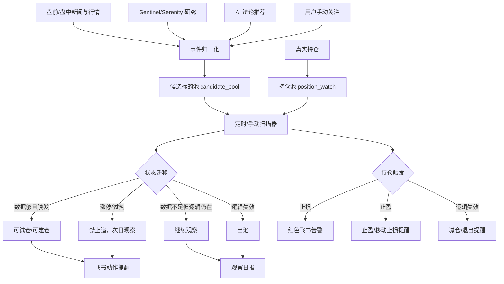

# 恭喜发财 v7.4.0-dev 设计：量化生命周期闭环底座

日期：2026-07-01
分支：codex/quant-lifecycle-v7-4
状态：feature 设计与工程 review

## 目标

v7.4.0 的目标不是继续生成更长的策略报告，而是把恭喜发财从“报告型 AI 助手”升级成“量化管理底座”：

- 一切以盈利为目的。
- 小账户默认是高收益验证账户，不是保守账户。
- 大账户才进入分层保守和回撤优先模式。
- 标的必须进入生命周期管理，不允许每天重新扫描、每天遗忘。
- 持仓必须进入生命周期管理，不允许只靠用户盯盘。
- 当前先用盘前、午盘、午后、收盘定时任务和手动运行把架构、数据、策略、监控、预警跑通；分钟级/秒级能力作为 v7.5/v8 的架构预留，不在 v7.4 首轮假装完成。

## 怀疑性 Review

### P0：系统没有真正的持久标的池

现状：`run_debate()` 每次只把当次 AI 输出的 `short_term.recommendations + mid_low_freq.recommendations` 拼成临时 `stock_pool`。`unaffordable_watchlist` 也只存在于当次 decision 内存里。

后果：

- 今天关注，明天忘记。
- 数据不足只变成报告占位符，不变成后续任务。
- 之前关注过的标的即使后来涨停，也不会触发再激活。

修复：

- 新增持久化 `candidate_pool`。
- 池外标的：数据够直接建议试仓/建仓；数据不够入池；不合格丢弃。
- 池内标的：符合预期升级；数据不足继续观察；不符合预期出池。

### P0：空仓时盘中任务跳过机会扫描

现状：午盘/午后逻辑在空仓时推送“空仓观望”类信息，没有扫候选池。

后果：

- 空仓账户最需要机会扫描，系统却在空仓时最安静。
- 000629 这类低价、可一手执行、盘中涨停扩散的标的不会触发提醒。

修复：

- 空仓时仍运行候选池扫描。
- 飞书推送分为：可试仓、只观察、禁止追、出池。

### P0：持仓风控没有吃到交易计划

现状：`MonitorService` 支持 `stop_loss_price` 和 `target_price`，但生产 `pos_dict` 只传代码、名称、成本价、id。

后果：

- 止损/止盈逻辑存在，但实际触发依据缺失。
- 系统只能泛泛提醒，不知道“该卖、该减、该移动止损还是继续拿”。

修复：

- 新增 `position_watch`。
- 每个持仓记录买入理由、成本、止损、目标、移动止损、失效条件、最大持有期、下一次复核时间。
- 持仓触发止损/止盈/逻辑失效时直接飞书提醒。

### P1：Sentinel/Serenity 仍停在研究层

现状：Sentinel 研究包在主报告里展示，但没有进入候选池构建和盘中触发。

后果：

- 数据有积累，但不能驱动行动。
- 研究层越做越厚，执行层仍然从零问 AI。

修复：

- Sentinel 新闻主题、Serenity 深挖候选、盘中高频新闻统一转为候选池事件。
- 研究结论不直接买卖，但必须产生“入池/继续观察/出池/禁止追”的状态迁移。

### P1：版本与运行态不一致

现状：README 为 `v7.3.1`，FastAPI/health 仍返回 `7.3.0`。

修复：

- feature 分支统一为 `v7.4.0-dev`。
- 稳定发布时再去掉 `-dev`。

## 账户分级策略

### 小账户：高收益验证

适用：资金池小于 2 万。

目标：

- 快速验证系统是否能抓到真实收益。
- 不以“永远不犯错”为目标，而是以有限亏损换高弹性机会。

默认规则：

- 单笔试仓：5%-15% 资金。
- 单笔硬亏损：本金 1.5%-3%。
- 优先标的：一手可执行、流动性足、题材或趋势明确、止损清晰。
- 允许低价高弹性标的，但禁止 ST、退市整理、流动性枯竭、无明确触发理由。

### 中账户：分层进攻

适用：2 万到 20 万。

规则：

- 进攻仓：20%-40%。
- 趋势/ETF 仓：20%-40%。
- 现金仓：20%-40%。

### 大账户：保守复利

适用：20 万以上。

规则：

- 回撤控制优先。
- 分散持仓、行业暴露、相关性约束、低波动组合成为主线。

## 新 Feature 架构

## 数据模型

### candidate_pool item

- `code`
- `name`
- `status`: `watching | actionable | blocked_chasing | removed | promoted_to_position`
- `source`: `ai_debate | sentinel | serenity | intraday_news | manual`
- `entered_at`
- `last_reviewed_at`
- `watch_days`
- `entry_reason`
- `missing_evidence`
- `trigger_rules`
- `exit_rules`
- `last_quote`
- `lot_value`
- `account_affordable`
- `score`
- `decision_history`

### position_watch item

- `code`
- `name`
- `shares`
- `cost_price`
- `entry_reason`
- `entry_source_candidate_id`
- `stop_loss_price`
- `target_prices`
- `trailing_stop_rule`
- `max_holding_days`
- `invalid_reason_rules`
- `last_quote`
- `last_alert_at`
- `alert_cooldowns`
- `status`: `holding | reduce_alert | stop_alert | take_profit_alert | closed`

## 定时/手动触发规则

v7.4.0 首轮使用现有盘前、午盘、午后、收盘定时任务和手动运行，不做分钟级轮询，不做秒级下单。

候选池触发：

- 涨幅 >= 3% 且量比 >= 2。
- 成交额 >= 1 亿。
- 一手成本 <= 当前可用现金。
- 若已经涨停或接近涨停，输出“禁止追/次日观察”，不输出买入。

持仓触发：

- 跌破止损价：红色飞书告警。
- 触及目标价：止盈或移动止损提醒。
- 放量下跌：风险提醒。
- 浮盈回撤超过阈值：移动止损提醒。
- 持仓逻辑失效：减仓/退出提醒。

## 飞书输出规范

每条飞书提醒必须包含：

- 标的。
- 当前价。
- 触发原因。
- 建议动作。
- 仓位或手数建议。
- 止损/止盈。
- 为什么现在提醒。
- 什么情况取消。

提醒等级：

- 红色：必须处理。
- 黄色：需要关注。
- 蓝色：可试仓。
- 绿色：正常巡检。

## 不在 v7.4.0 范围

- 自动真实下单。
- 分钟级自动轮询。
- 秒级行情交易。
- 高频撮合。
- 多账户资金路由。
- 复杂机器学习因子训练。

这些需要数据延迟、交易接口、回测系统和权限边界先稳定后再做。

## 测试要求

- 池外标的数据不足必须入池，而不是只写“观望”。
- 池内标的满足涨幅/量比/成交额/可买性必须触发飞书提醒。
- 池内标的涨停必须标记“禁止追”，但不能静默。
- 持仓跌破止损必须生成 high alert。
- 持仓触及目标价必须生成止盈提醒。
- `medium` 与 `mid` 等级必须统一，不能因为字段不一致丢告警。
- `user_portfolio.json` 与 DB 不一致时必须先同步或报警。

## 交付拆分

1. v7.4.0-dev.1：版本统一、README/CHANGELOG 更新、candidate_pool/position_watch 设计落地。
2. v7.4.0-dev.2：持久化服务与单元测试。
3. v7.4.0-dev.3：盘前入池、午盘/午后定时扫描与飞书提醒。
4. v7.4.0-dev.4：盘前/盘中/收盘报告改为池生命周期报告，并接入 Sentinel/Serenity 入池。
5. v7.4.0：稳定版，跑通一周验证后发布。
